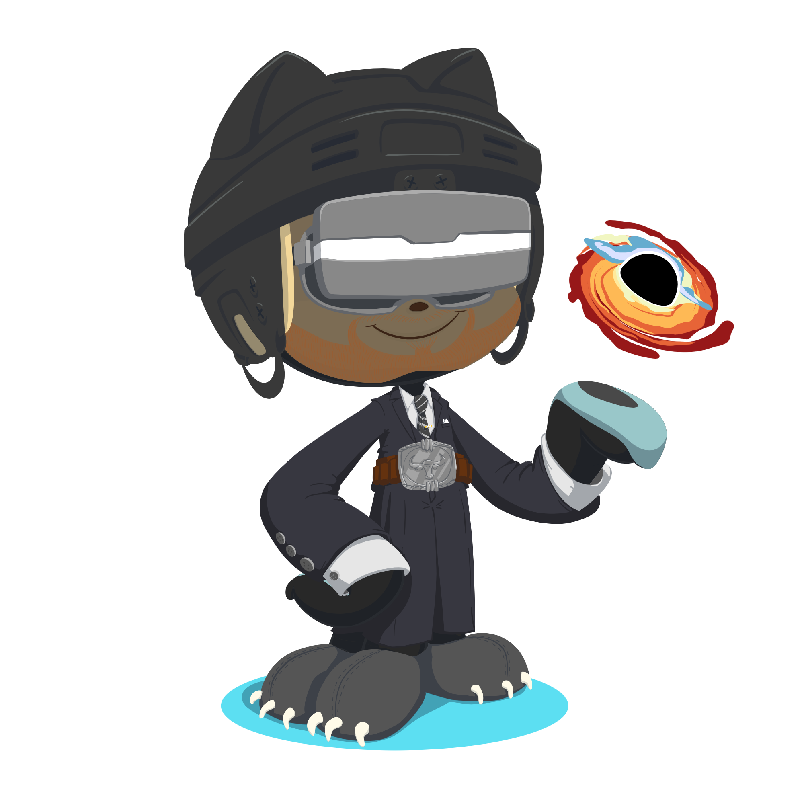

    

        
    

    

        
    

    

         
    

    

         
        

            <strong>
    Sure, here's a bio for your GitHub profile:

---

👋 Hi there! I'm Feyin, a passionate software engineer with a focus on backend development. Here's a glimpse into my skillset:

**Core Skills:**
- Proficient in Data Structures, Algorithms, Object-Oriented Programming, Operating Systems, Database Management Systems, and Computer Networks.

**Languages:**
- Experienced in Golang, JavaScript, and TypeScript.
- Intermediate knowledge in Java, C#, C++, and C.
- Familiar with PHP and Python.

**Frameworks & Libraries:**
- Skilled in React.js, Express.js, NestJS, Gin, TypeORM, Mongoose, and React Native.

**Databases:**
- Expertise in PostgreSQL, MySQL, and MongoDB.

**DevOps:**
- Experienced with AWS services such as EC2, EFS (Elastic File System), EBS (Elastic Block Storage), S3, RDS (Relational Database Service), Elastic Beanstalk, IAM, VPC (Virtual Private Cloud), ELB (Elastic Load Balancer), Route 53, and Autoscaling.
- Proficient in Docker, Kubernetes, and GitHub Actions CI/CD.

**Other Skills:**
- Proficient in HTML, CSS, Git, and Linux.

I'm passionate about building scalable, efficient, and robust backend systems. Let's connect and build amazing software together!

---          </strong>
        

        <ul>
            <li>🌱 <b>I’m currently learning</b>: Computer Science and Software Engineering.</li>
            <li>📫 <b>How to reach me</b>: Catch and follow me from the above links 👆, in addition to follow me here.</li>
            <li>😄 <b>Fun fact</b>: I love Cars(🚗), Codeing(💻), Traveling(🌍), and Photography(📷).</li>
        </ul>
    

    

        
        
Loading

    

------
